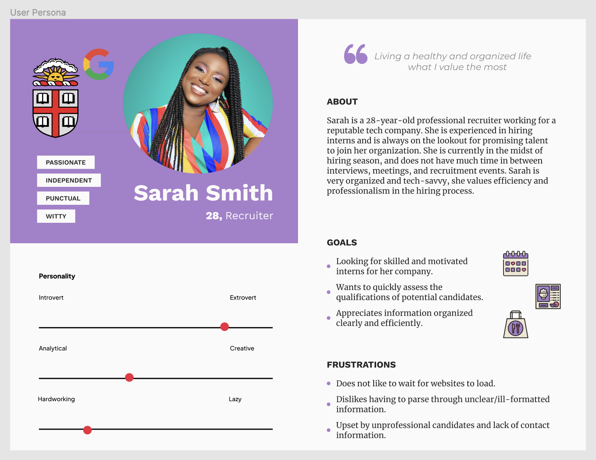
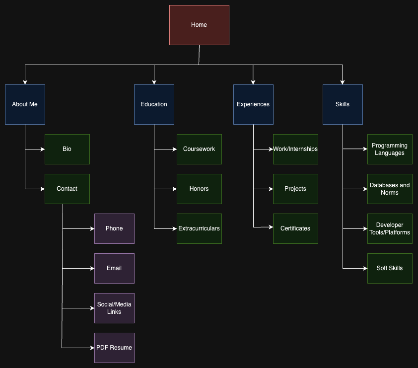
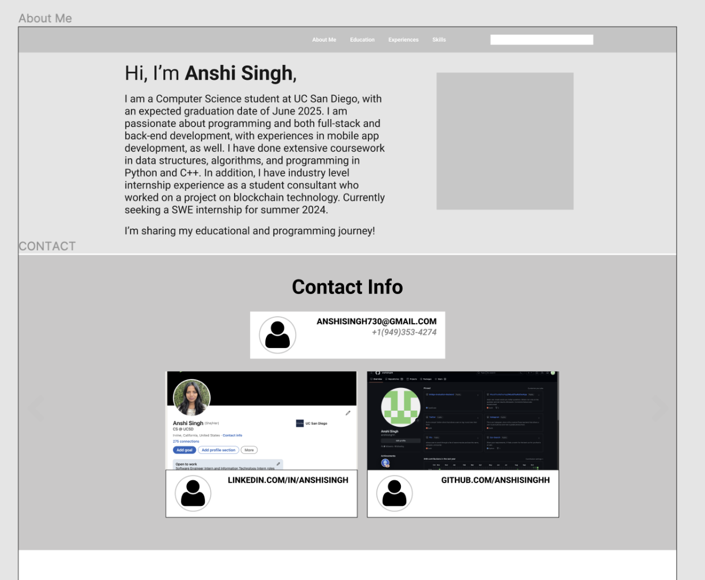
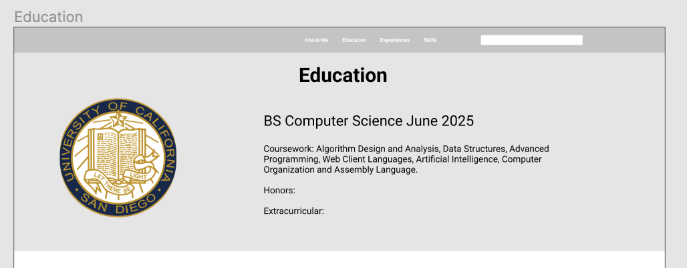
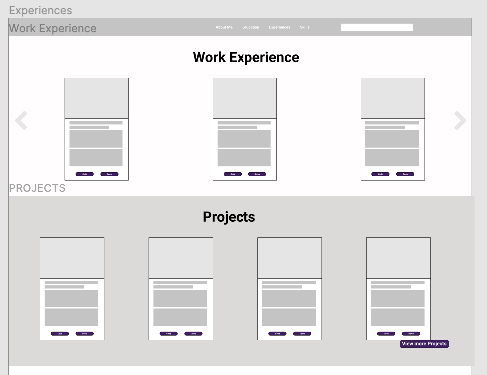

# HW2 - Plan Site and Semantic HTML Execution - Site Build Out Phase 1

https://anshicse134bhw2.netlify.app/

### Short Summary
The purpose of my site is to showcase my skills, experiences, and achievements to potential employers, clients, and collaborators. It should detail my qualifications and engage recruiters with an accessible layout, encouraging them to learn more and, ideally, get in touch regarding potential opportunities.

### Persona Diagram

### Site Diagram

### Wireframe(s)

### Technical Requirements
I am going to use HTML, CSS, and JavaScript for the frontend development, to create an interactive and responsive interface. I want to adhere to web accessibility standards by using proper HTML semantic elements. I am going to use Responsive Web Design, so the website's content can be displayed correctly and uniformly on various devices, platforms, and screen types. In addition, I want my website to be compatible with all the popular web browsers such as Chrome, Firefox, Safari, and Edge. In order to do this, I am going to test my website on BrowserStack, CrossBrowserTesting, and LambdaTest to simulate different browsers and devices. In addition, to enhance user experience I will optimize the website for fast loading times, trying to keep the total size of the website under 1-2 MB, so that it is easier to load even with poor internet connection.  This can be done by using optimized image formats such as WebP, limiting the number of HTTP requests, and limiting the use of external scripts and CSS/JavaScript files. The website will be hosted on Netlify because it has continuous deployment, HTTPS, and automatic scaling. This ensures the website is functioning, secure, and up-to-date. In addition, I will be using Git for version control, which allows me to track my changes.

